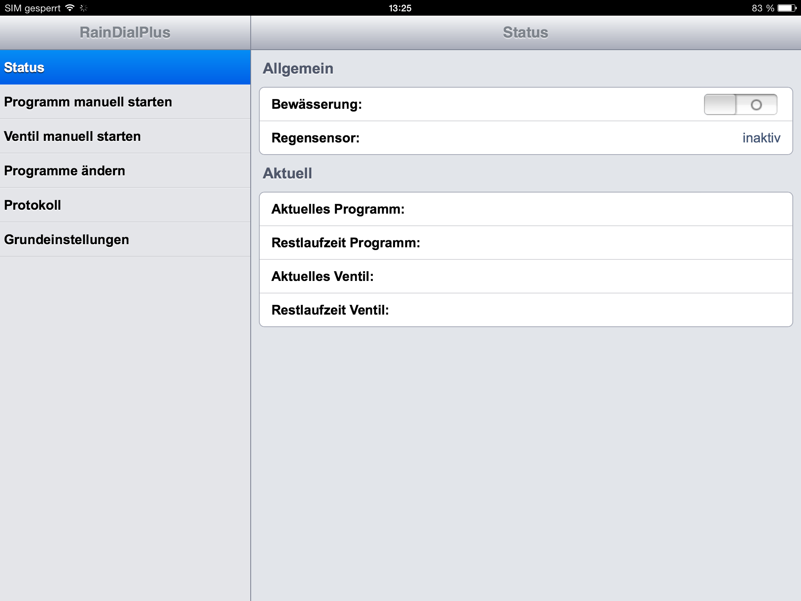
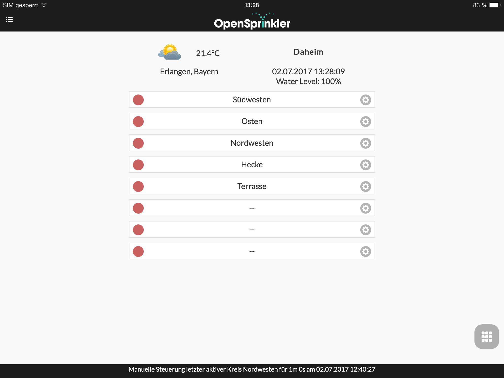
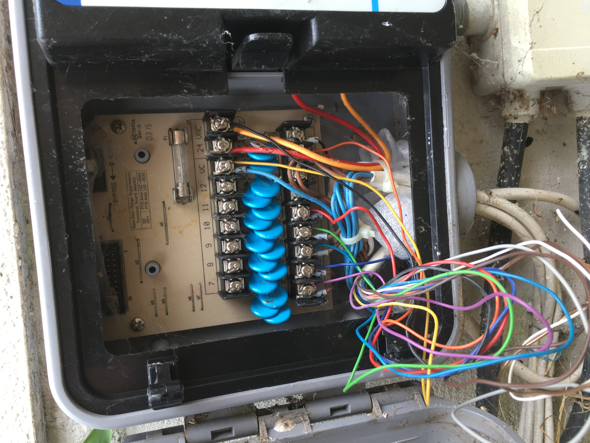
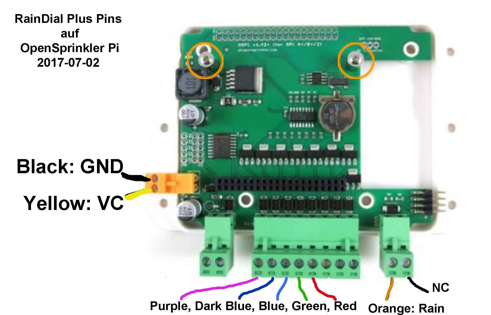

# OpenSprinkler Pi

This short weekend projects replaces my initial hardware project using the [Pollin Board](http://www.pollin.de/shop/dt/NjI5OTgxOTk-/Bauelemente_Bauteile/Entwicklerboards/Sonstige_Boards/AVR_NET_IO_Fertigmodul.html?gclid=COuLuoa-6tQCFc8K0wod6JcLww) and [Ethersex](http://www.ethersex.de/index.php/Main_Page) firmware with OpenSprinkler Pi.

The good old 56 KByte web app stored in the small firmware of an ATMega644 (20 MHz, 64 KByte flash memory, 2 KByte EEPROM, 4 KByte SRAM) still did its job on my iPad 1 and 3:



But maintaining it is very hard, so it was time to move on to a big fat solution running on Raspberry Pi 2 (900 MHz, 1 GByte RAM, 8 GByte SD card):



## Wiring

The RainDial Plus will be replaced. The following wiring is used to connect from the outdoor case to the OpenSprinkler Pi running indoors.



* Yellow - VC
* Black - VAC
* Orange - Sensor (left, right is VAC)
* Purple - 1
* Dark Blue - 2
* Blue - 3
* Green - 4
* Red - 5

The indoor wiring



The intermediate wiring


## Firmware

A Raspberry Pi 2 running HypriotOS with Docker CE 17.03 is running the OpenSprinkler service in a Docker container.

### Build ospi Docker image

I have forked the OpenSprinker-Firmware repo and added a `Dockerfile` and `.travis.yml` to build it online.
See [StefanScherer/OpenSprinkler-Firmware](https://github.com/StefanScherer/OpenSprinkler-Firmware) for the two added files.

#### Dockerfile

```Dockerfile
FROM resin/rpi-raspbian AS build
RUN apt-get update && apt-get install -y build-essential
COPY . /code
WORKDIR /code
RUN ./build.sh ospi
FROM resin/rpi-raspbian
COPY --from=build /code/OpenSprinkler /OpenSprinkler
CMD ["/OpenSprinkler"]
```

#### .travis.yml

```yaml
sudo: required

services:
 - docker

script:
  - echo "Updating Docker engine to 17.05.0"
  - sudo service docker stop
  - curl -fsSL https://get.docker.com/ | sudo sh
  - docker version
  - docker run --rm --privileged multiarch/qemu-user-static:register --reset
  - docker build -t ospi .
  - >
    if [ -n "$TRAVIS_TAG" ]; then
      # push image
      travis_retry timeout 5m docker login -u="$DOCKER_USER" -p="$DOCKER_PASS"
      docker tag ospi stefanscherer/ospi:$TRAVIS_TAG
      docker push stefanscherer/ospi:$TRAVIS_TAG
    fi
```

#### Docker Hub

The Docker image is built with Travis CI and pushed to the Docker Hub. The Docker image is available at https://hub.docker.com/r/stefanscherer/ospi/

## Run the service

This `docker-compose.yml` is used to run the service on port 8080.

```yaml
ospi:
  image: stefanscherer/ospi:2.1.7
  restart: always
  privileged: true
  volumes:
    - '/dev/mem:/dev/mem'
  expose:
    - 8080
  ports:
    - 8080:8080
```

## Backup

Use the OpenSprinkler UI or iOS/Android app to save a backup.
